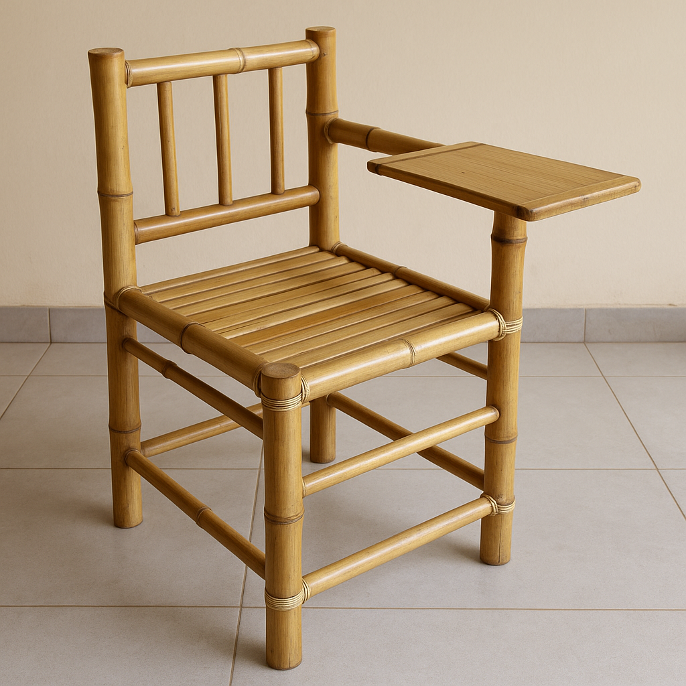

# How to Make a Bamboo Student Chair for Schools

Making a bamboo student chair for schools can be an eco-friendly and sustainable project. Here’s a basic guide to help you get started with building one:

## Materials

- **Bamboo poles**: Select thick and strong bamboo for the frame.
- **Bamboo slats**: These will be used for the seat and backrest.
- **Wood or plywood** (optional): For additional reinforcement of the seat.
- **Screws, nails, or bamboo dowels**: To join the parts.
- **Rattan or natural fiber rope**: For binding and support.
- **Tools**: Saw, drill, sandpaper, measuring tape, hammer, and protective gear.

## Steps

### 1. Select and Treat the Bamboo
Choose mature bamboo poles, as they are stronger. Cut them to the required lengths. Treat the bamboo to prevent cracking, insect infestation, and moisture damage by soaking it in a solution of borax and boric acid or using heat treatment. Let the bamboo dry completely.

### 2. Create the Frame
- **Legs**: Cut four bamboo poles of equal length (about 40–45 cm for a child’s chair or 50–60 cm for older students).
- **Seat Frame**: Cut four shorter poles (two for the width and two for the depth of the seat). The depth is typically 35–40 cm.
- **Backrest Support**: Attach two vertical poles at the back of the seat frame to support the backrest (height should be around 35–40 cm above the seat level).

### 3. Assemble the Frame
Drill holes at the connection points and join the bamboo poles with screws or bamboo dowels. Alternatively, you can tie the joints securely with rattan or natural fiber rope for a rustic look and flexibility. Ensure the frame is sturdy by reinforcing key points like the corners of the seat and leg joints.

### 4. Make the Seat
You can either:
- Attach bamboo slats across the seat frame to form a strong sitting surface.
- Use a wooden or plywood piece cut to the seat size for added strength. Secure this to the frame.

### 5. Add the Backrest
Attach bamboo slats horizontally to the vertical backrest supports. These slats should be spaced evenly to provide comfort.

### 6. Finishing
Sand all rough edges to ensure the chair is smooth and safe for students. Apply varnish or natural oil for protection and a polished look.

### 7. Test the Chair
Ensure the chair is stable, comfortable, and can bear weight without wobbling.

## Illustration of Bamboo Student Chair

Figure: Handcrafted bamboo student chair with slatted seat, vertical backrest, and writing surface.
